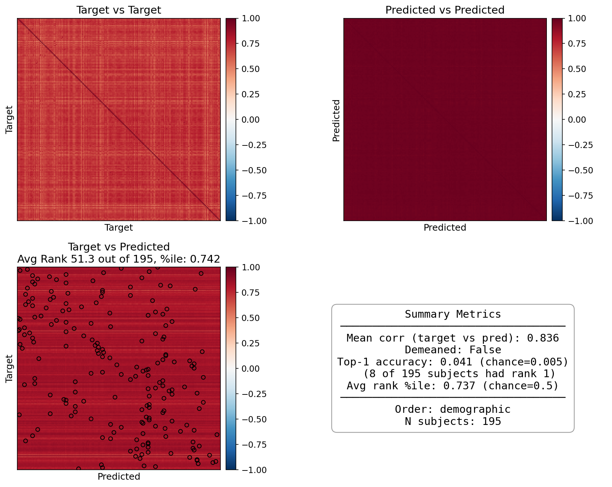
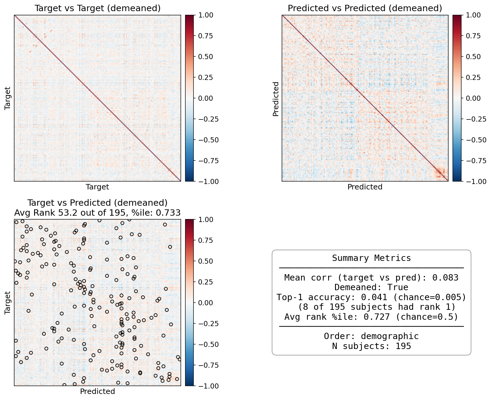
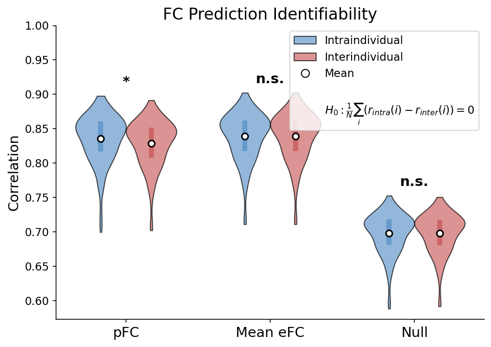
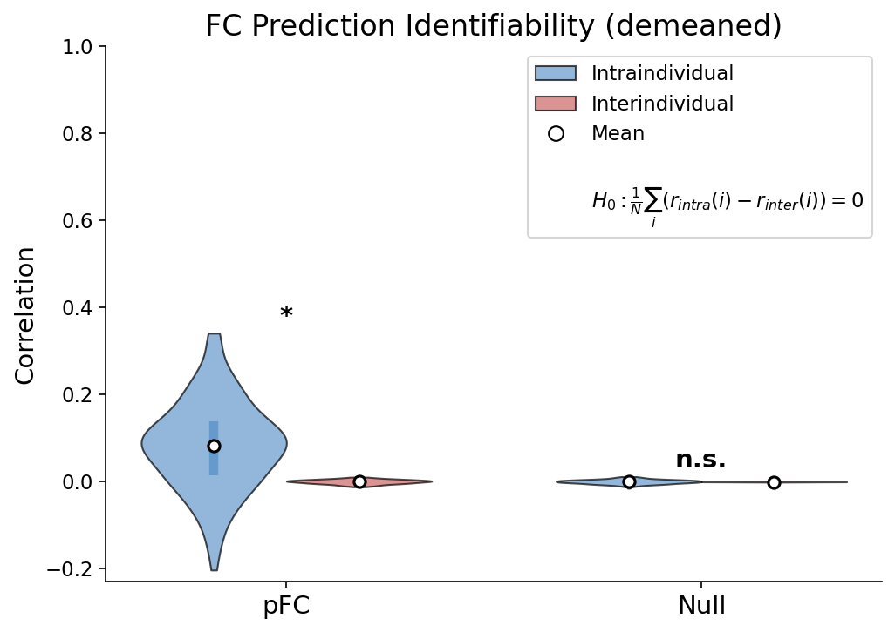
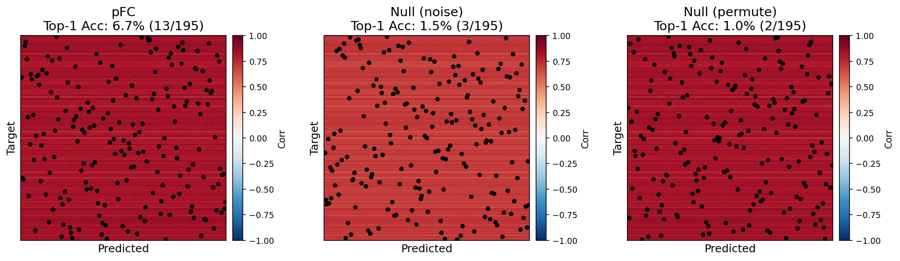
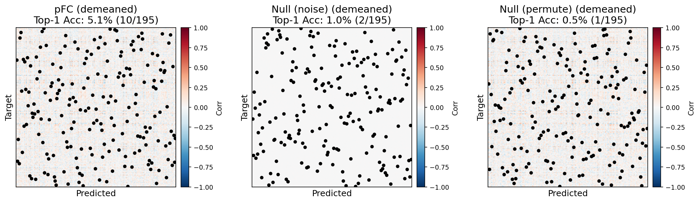
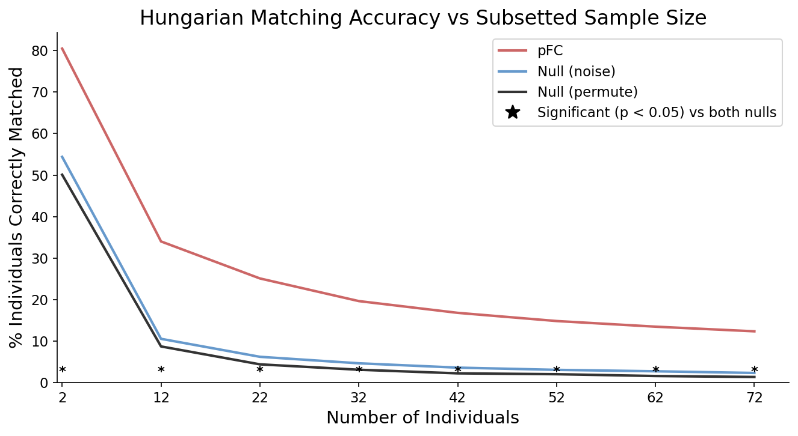
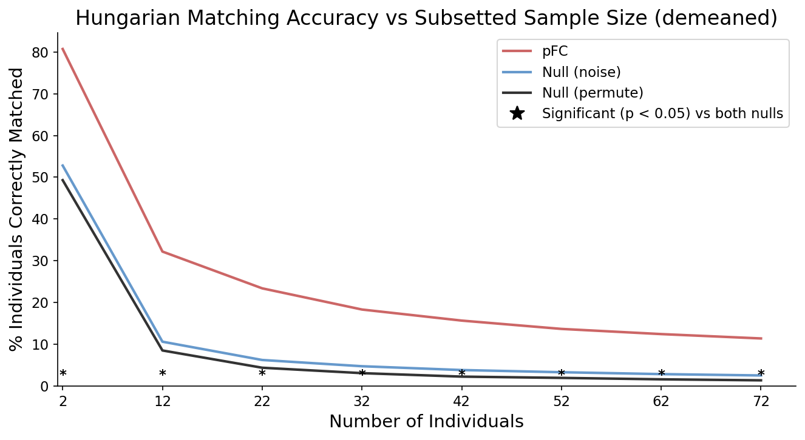
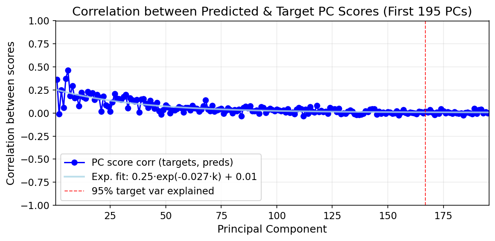
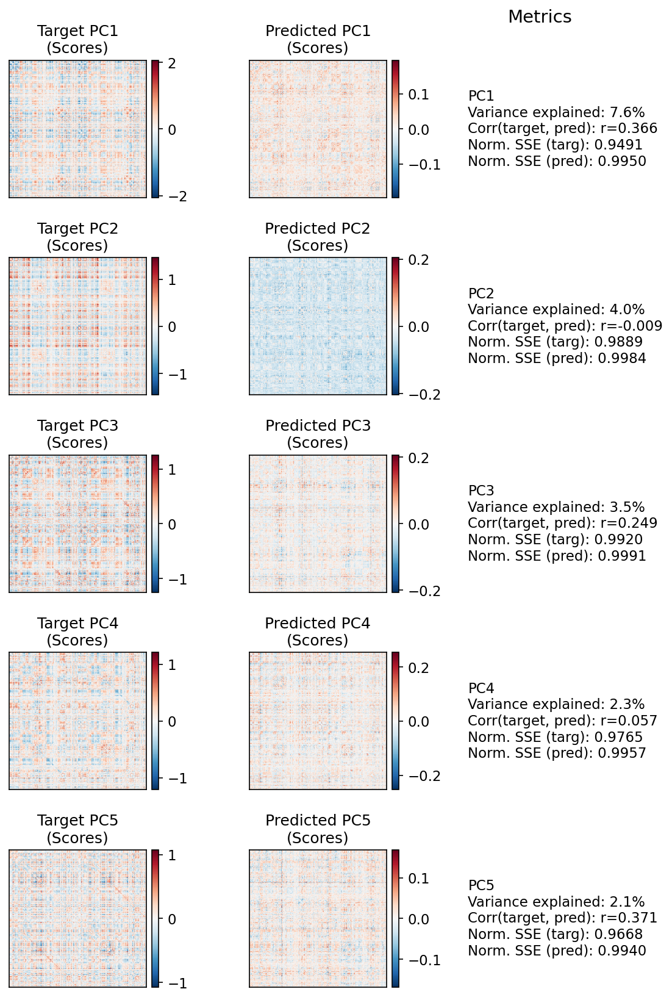

# FC Prediction Evaluation Report

**Model:** Krakencoder_precomputed | **Partition:** test | **N subjects:** 195 | **Generated:** 2026-03-24 21:11

---

## Identifiability Heatmaps

Pairwise correlation matrices between predicted and target connectomes. Diagonal dominance indicates subject-specific predictions.

**Top-1 Accuracy:** Fraction of subjects whose own prediction is the best match.

$$\text{Top-1 Acc} = \frac{1}{N}\sum_{i=1}^{N} \mathbb{1}[\arg\max_j \, r(\hat{X}_i, X_j) = i]$$

**Avg Rank %ile:** For each subject, count how many other subjects' predictions have lower correlation with their target than their own prediction does.

$$\text{avgrank} = \frac{1}{N}\sum_{s=1}^{N}\left(\frac{1}{N}\sum_{a \neq s}^{N} \mathbb{1}[r(X_s, \hat{X}_a) < r(X_s, \hat{X}_s)]\right)$$

<table><tr>
<td align="center"><b>Raw</b> </td>
<td align="center"><b>Demeaned</b> </td>
</tr></table>

| Metric | Raw | Demeaned |
|--------|-----|----------|
| Mean Corr | 0.836 | 0.083 |
| Top-1 Acc | 0.041 | 0.041 |
| Avg Rank %ile | 0.737 | 0.727 |

---

## Identifiability Violin

Tests whether intraindividual correlations (subject's prediction vs their own target) exceed interindividual correlations (vs other subjects' targets) using a **one-sample t-test**.

For each subject $i$, compute $d_i = r_{intra}(i) - r_{inter}(i)$, then test:

$$H_0: \frac{1}{N}\sum_i d_i = 0 \quad \text{(one-sample t-test)}$$

Significance ($*$) indicates the model captures individual-specific features beyond group average.

<table><tr>
<td align="center"><b>Raw</b> </td>
<td align="center"><b>Demeaned</b> </td>
</tr></table>

| Metric | Raw | Demeaned |
|--------|-----|----------|
| pFC r_intra | 0.836 | 0.083 |
| pFC r_inter | 0.829 | 0.000 |
| pFC Cohen's d | 0.82 | 0.80 |
| pFC p-value (t-test) | 1.11e-23 | 1.07e-22 |

---

## Hungarian Matching

The Hungarian algorithm derives an optimal **one-to-one** mapping between target (eFC) and predicted (pFC) matrices that maximizes total similarity. Unlike greedy matching (which permits one-to-many assignments), Hungarian matching ensures each prediction is assigned to exactly one target.

**Procedure:**
1. Compute similarity matrix $R_{ij} = r(X_i, \hat{X}_j)$ between all target-prediction pairs
2. Find permutation $\pi^*$ that maximizes total similarity:

$$\pi^* = \arg\max_{\pi \in S_N} \sum_{i=1}^{N} R_{i,\pi(i)}$$

3. **Top-1 Acc** = fraction of subjects assigned to themselves: $\frac{1}{N}\sum_i \mathbb{1}[\pi^*(i) = i]$

**Null conditions:**
- **Null (noise):** Predictions replaced with mean + Gaussian noise
- **Null (permute):** Columns of similarity matrix randomly permuted (chance baseline)

<table><tr>
<td align="center"><b>Raw</b> </td>
<td align="center"><b>Demeaned</b> </td>
</tr></table>

| Condition | Raw Top-1 Acc | Demeaned Top-1 Acc |
|-----------|---------------|---------------------|
| pFC | 0.067 | 0.051 |
| Null (noise) | 0.015 | 0.010 |
| Null (permute) | 0.010 | 0.005 |

---

## Hungarian Sample Size Analysis

Matching accuracy as a function of subset sample size. Stars indicate sample sizes where pFC significantly exceeds both null baselines (FDR-corrected, two-sample t-test).

<table><tr>
<td align="center"><b>Raw</b> </td>
<td align="center"><b>Demeaned</b> </td>
</tr></table>

---

## PCA Structure

Subject-mode PCA captures the main modes of inter-subject variation in connectivity. High PC score correlations indicate the model preserves individual differences along each mode.

**Procedure:**
1. Mean-center data: $\tilde{X} = X - \bar{X}_{train}$ where $X \in \mathbb{R}^{N \times E}$ (subjects $\times$ edges)
2. Transpose for subject-mode PCA: $\tilde{X}^T \in \mathbb{R}^{E \times N}$
3. Compute eigenvectors $B_k$ (loadings) and project: $C_k = \tilde{X}^T B_k$ (PC scores, length $E$)
4. Project predictions into same basis: $C^{pred}_k = \tilde{\hat{X}}^T B_k$
5. Correlate scores: $\text{PC Corr}_k = r(C^{target}_k, C^{pred}_k)$

$$\text{PC Corr}_k = \text{corr}(C^{target}_k, C^{pred}_k)$$

| Metric | Value |
|--------|-------|
| PCs for 95% variance | 167 |
| PC1 Corr | 0.366 |
| PC5 Corr | 0.371 |
| Exp. decay rate (b) | 0.0266 |

---

## Summary Metrics

| Category | Metric | Value |
|----------|--------|-------|
| Base | MSE | 0.0136 |
| Base | R² | -0.0314 |
| Base | Pearson Corr | 0.8358 |
| Base | Demeaned Pearson | 0.0829 |
| Identifiability | Top-1 Acc | 0.041 |
| Identifiability | Avg Rank %ile | 0.737 |
| Violin | Cohen's d | 0.82 |
| Violin | p-value | 1.11e-23 |
| Hungarian | pFC Top-1 Acc | 0.067 |
| PCA | PC1-5 Corr | 0.366, -0.009, 0.249, 0.057, 0.371 |
| PCA | Exp. decay rate (b) | 0.0266 |
