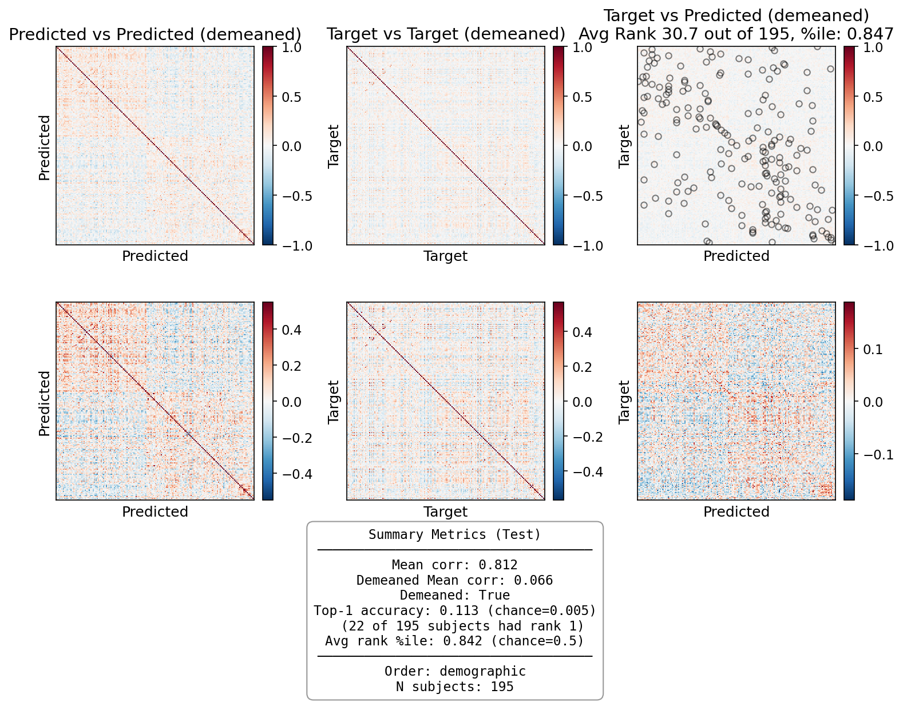
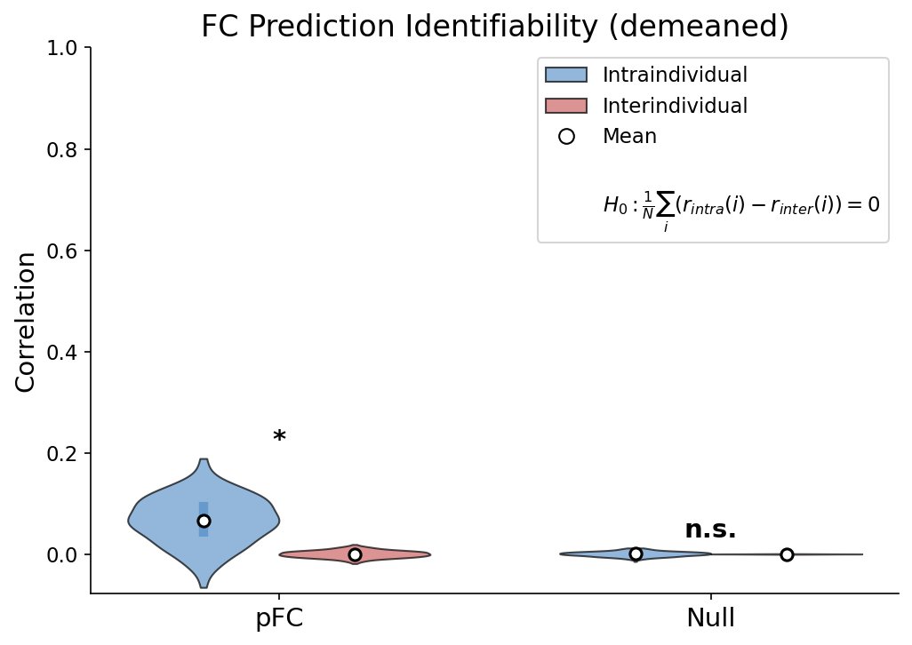
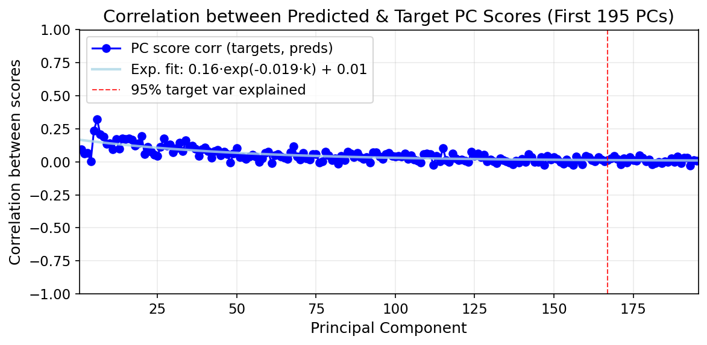
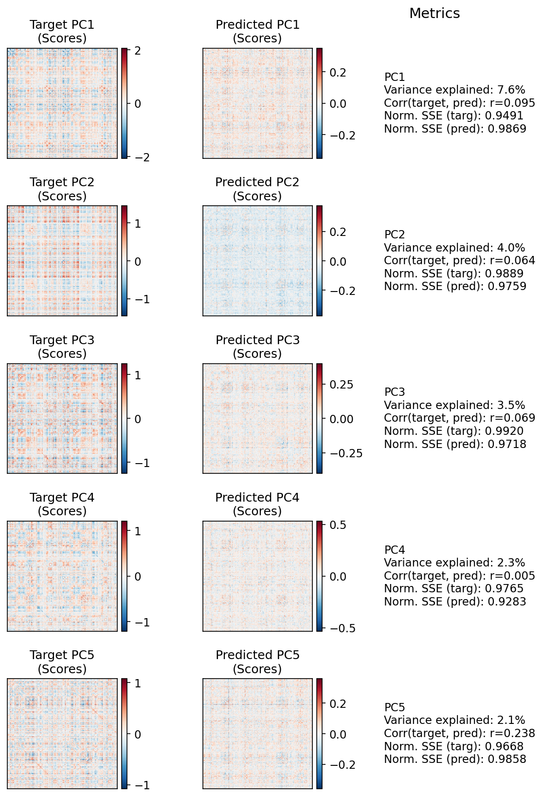
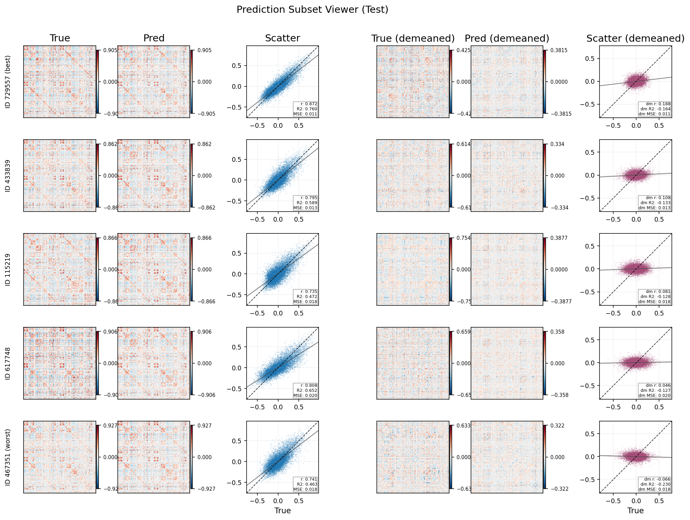

# FC Prediction Evaluation Report

**Model:** LatentAttnMasked_structured_linear_backbone | **Partition:** test | **N subjects:** 195 | **Generated:** 2026-04-23 16:14

---

## Identifiability Heatmaps

Pairwise correlation matrices between predicted and target connectomes. Diagonal dominance indicates subject-specific predictions.

**Top-1 Accuracy:** Fraction of subjects whose own prediction is the best match.

$$\text{Top-1 Acc} = \frac{1}{N}\sum_{i=1}^{N} \mathbb{1}[\arg\max_j \, r(\hat{y}_i, y_j) = i]$$

**Avg Rank %ile:** For each subject, count how many other subjects' predictions have lower correlation with their target than their own prediction does.

$$\text{avgrank} = \frac{1}{N}\sum_{s=1}^{N}\left(\frac{1}{N}\sum_{a \neq s}^{N} \mathbb{1}[r(X_s, \hat{X}_a) < r(X_s, \hat{X}_s)]\right)$$

| Metric | Value |
|--------|-------|
| Mean Corr | 0.812 |
| Demeaned Mean Corr | 0.066 |
| Top-1 Acc | 0.113 |
| Avg Rank %ile | 0.842 |

---

## Identifiability Violin

Tests whether intraindividual correlations (subject's prediction vs their own target) exceed interindividual correlations (vs other subjects' targets) using a **one-sample t-test**.

For each subject $i$, compute $d_i = r_{intra}(i) - r_{inter}(i)$, then test:

$$H_0: \frac{1}{N}\sum_i d_i = 0 \quad \text{(one-sample t-test)}$$

Significance ($*$) indicates the model captures individual-specific features beyond group average.

| Metric | Value |
|--------|-------|
| pFC r_intra | 0.066 |
| pFC r_inter | 0.000 |
| pFC Cohen's d | 1.40 |
| pFC p-value (t-test) | 9.60e-48 |

---

## PCA Structure

Subject-mode PCA captures the main modes of inter-subject variation in connectivity. High PC score correlations indicate the model preserves individual differences along each mode.

**Procedure:**
1. Mean-center data: $\tilde{X} = X - \bar{X}_{train}$ where $X \in \mathbb{R}^{N \times E}$ (subjects $\times$ edges)
2. Transpose for subject-mode PCA: $\tilde{X}^T \in \mathbb{R}^{E \times N}$
3. Compute eigenvectors $B_k$ (loadings) and project: $C_k = \tilde{X}^T B_k$ (PC scores, length $E$)
4. Project predictions into same basis: $C^{pred}_k = \tilde{\hat{X}}^T B_k$
5. Correlate scores: $\text{PC Corr}_k = r(C^{target}_k, C^{pred}_k)$

$$\text{PC Corr}_k = \text{corr}(C^{target}_k, C^{pred}_k)$$

| Metric | Value |
|--------|-------|
| PCs for 95% variance | 167 |
| PC1 Corr | 0.095 |
| PC5 Corr | 0.238 |
| Exp. decay rate (b) | 0.0194 |

---

## Prediction Subset Viewer

Compact row-wise viewer of selected subjects: target matrix, prediction matrix, and edge-wise scatter with per-subject metrics.

| Metric | Value |
|--------|-------|
| Subjects Shown | 5 |
| Display Modes | raw, demeaned |
| Include Best/Worst | True |
| Selected Subject IDs | 729557, 433839, 115219, 617748, 467351 |

---

## Summary Metrics

| Category | Metric | Value |
|----------|--------|-------|
| Base | MSE | 0.0155 |
| Base | R2 | -0.1798 |
| Base | Pearson Corr | 0.8123 |
| Base | Demeaned Pearson | 0.0665 |
| Identifiability | Top-1 Acc | 0.113 |
| Identifiability | Avg Rank %ile | 0.842 |
| Violin | Cohen's d | 1.40 |
| Violin | p-value | 9.60e-48 |
| PCA | PC1-5 Corr | 0.095, 0.064, 0.069, 0.005, 0.238 |
| PCA | Exp. decay rate (b) | 0.0194 |
