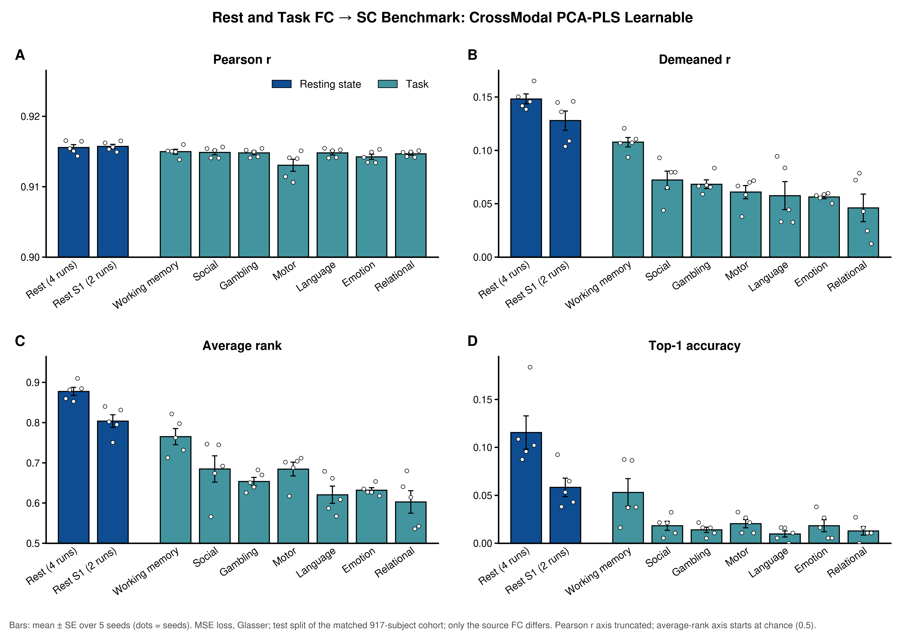

# E0: Which task FC best predicts SC

**Code:** this folder: `config.yml` (conditions, seeds, tune budget, labels), `make_configs.py` → `configs/<condition>.yml`,
`launch.sh` / `submit.py` (one array per condition, index = seed; `--repo` runs from a worktree), `run.py` (scrape,
tables, figures), `checks/check_fc_source_condition.py` (cohort, splits, rebinding, PCA mean). Data: `HCP_Base(fc_source_condition=...)`.
**Tables (tracked):** `results/tables/{seed_records,summary,runs,paired_vs_rest}.csv`, `summary.md`.
**Figures:** `results/figures/bars_{pearson,demeaned_pearson,avg_rank,top1_acc}.png`; `bars_all_metrics.png` (2 × 2 summary figure, E0-specific styling in `run.py`); `scan_time.png` (each metric vs scan time).
**Runs:** logs `results/logs/e0_taskfc_<condition>_<job>_<seed>.out` (main checkout); pilot jobs `19251071` (rest),
`19251073` (wm), full run `19253190`–`19253201`; check job `19248618` (ALL_OK).
**Status:** complete 2026-10-06 · spec v3 E0 · branch `e0-task-fc`

---

## 1. Question

For FC → SC, which FC condition (rest or one of the seven HCP tasks) gives the best SC reconstruction, on Pearson r,
demeaned r, average rank and top-1?

## 2. Setup

| | |
|---|---|
| Model / loss | `CrossModal_PCA_PLS_learnable`, MSE only, v2:E2.2 FC → SC config; 16-trial Optuna/ASHA tune per seed |
| Source | FC of one condition: `rest` (4 runs, reference), `rest_S1` (session 1, 2 runs), 7 tasks (LR+RL combined) |
| Target | SC (default metric, log1p), Glasser |
| Cohort / splits | subjects with every condition: 917 of 957; per-seed `train_val_test` labels restricted to it (seed 0: 659 / 74 / 184); seeds 0–4, identical across conditions |
| Comparison | test split; Δ = paired-by-seed difference from `rest`, ± SE over 5 seeds |
| Compute | 45 tasks on 1 GPU each (4 trials packed), median 17 min (13–30): 13.6 GPU-h; ≈ 10.5 h wall clock (group GPU quota allowed 1–2 tasks at once) |

Every run loads all conditions, so the cohort and splits are the same; `fc_source_condition` rebinds the FC arrays
before the train-split PCA, so the source PCA basis is fit on that condition.

## 3. Results (test, mean over 5 seeds; Δ vs rest ± SE)

| Source FC | Scan time | Pearson r | Demeaned r | Δ | Avg rank | Δ | Top-1 | Δ |
|---|---|---|---|---|---|---|---|---|
| Rest (4 runs) | 57.6 min | 0.9156 | 0.1483 | — | 0.878 | — | 0.116 | — |
| Rest S1 (2 runs) | 28.8 min | 0.9157 | 0.1280 | −0.020 ± 0.007 | 0.804 | −0.074 ± 0.017 | 0.058 | −0.057 ± 0.017 |
| Working memory | 9.7 min | 0.9150 | 0.1078 | −0.041 ± 0.006 | 0.765 | −0.113 ± 0.018 | 0.053 | −0.063 ± 0.017 |
| Social | 6.6 min | 0.9149 | 0.0723 | −0.076 ± 0.007 | 0.685 | −0.193 ± 0.033 | 0.018 | −0.097 ± 0.014 |
| Gambling | 6.1 min | 0.9148 | 0.0684 | −0.080 ± 0.002 | 0.654 | −0.224 ± 0.004 | 0.014 | −0.102 ± 0.017 |
| Motor | 6.8 min | 0.9131 | 0.0610 | −0.087 ± 0.005 | 0.685 | −0.193 ± 0.020 | 0.021 | −0.095 ± 0.017 |
| Language | 7.6 min | 0.9148 | 0.0577 | −0.091 ± 0.015 | 0.621 | −0.257 ± 0.031 | 0.010 | −0.106 ± 0.020 |
| Emotion | 4.2 min | 0.9143 | 0.0565 | −0.092 ± 0.006 | 0.632 | −0.246 ± 0.009 | 0.018 | −0.097 ± 0.021 |
| Relational | 5.6 min | 0.9147 | 0.0462 | −0.102 ± 0.016 | 0.603 | −0.275 ± 0.035 | 0.013 | −0.103 ± 0.018 |

Scan time = HCP volumes (LR+RL, or 4 / 2 rest runs of 1200) × TR 0.72 s. Top-1 chance with 184 test subjects is 0.005.

## 4. Findings

1. **Rest is the best source on every individual-level metric, and every task is below it.** Each task loses
   0.04–0.10 demeaned r, 0.11–0.28 avg rank and 0.06–0.11 top-1 against rest; all paired Δ are several SE from zero.
   Pearson r is flat (0.913–0.916) because it is dominated by the group-mean SC every condition predicts.
2. **Working memory is the clear best task.** It beats every other task in demeaned r on 5/5 seeds (WM − social
   +0.036 ± 0.011; WM − gambling +0.040 ± 0.006) and keeps half of rest's top-1 (0.053), while the other six tasks
   sit near 0.01–0.02.
3. **Scan length explains much, but not all, of the ordering.** Halving rest (rest S1) costs 0.020 demeaned r and half
   of top-1; WM, with a third of rest S1's scan time, is a further 0.020 lower (5/5 seeds) in demeaned r but matches
   it in top-1 within noise. Among the six shorter tasks the spread is small (0.046–0.072) and only loosely tracks
   length (language, the second-longest task, is fifth). Condition and data quantity remain confounded
   ([`scan_time.png`](results/figures/scan_time.png); Pearson r on log scan time / Spearman ρ, all 9 conditions vs
   tasks only: demeaned r 0.94 / 0.83 vs 0.73 / 0.64, avg rank 0.92 / 0.78 vs 0.70 / 0.54, top-1 0.93 / 0.65 vs
   0.61 / 0.25; the all-9 values lean on the two rest points). WM sits above the log-scan-time fit in every metric.
   A length-matched comparison
   (truncate rest to a task's volume count) would separate them.
4. **Rest on the matched cohort is close to E2.2.** 0.148 demeaned r / 0.878 avg rank vs v2:E2.2's 0.162 / 0.889 on
   the full 957-subject cohort with 64-trial tunes; the gap is consistent with the smaller cohort and tune budget.
5. **Seed spread is larger for some tasks** (language, relational, social: SE over seeds 0.008–0.013 demeaned r vs
   0.002–0.006 for emotion, gambling, motor, WM), so the order among the six shorter tasks is not settled with 5 seeds.

## 5. Caveats

- Scan length differs by condition (§3) and is not controlled; see finding 3.
- 16-trial tunes (v2:E2.2 used 64); per-condition hyperparameters differ (`tables/runs.csv`).
- The best-trial report does not record `fc_source_condition`; `run.py` asserts each result ran its condition's
  config (FC → SC).

## 6. To-do (easily executable)

- 4S456Parcels replication (`parcellation: 4S456Parcels` in `make_configs.py`; caches exist).
- SC → task FC (reverse direction).
- Length-matched rest control (rest truncated to WM's / a short task's volume count).

Last updated at: 2026-10-06 EDT
